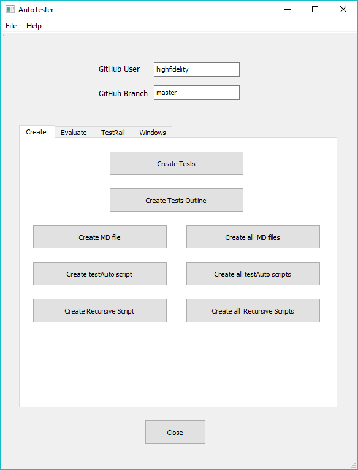
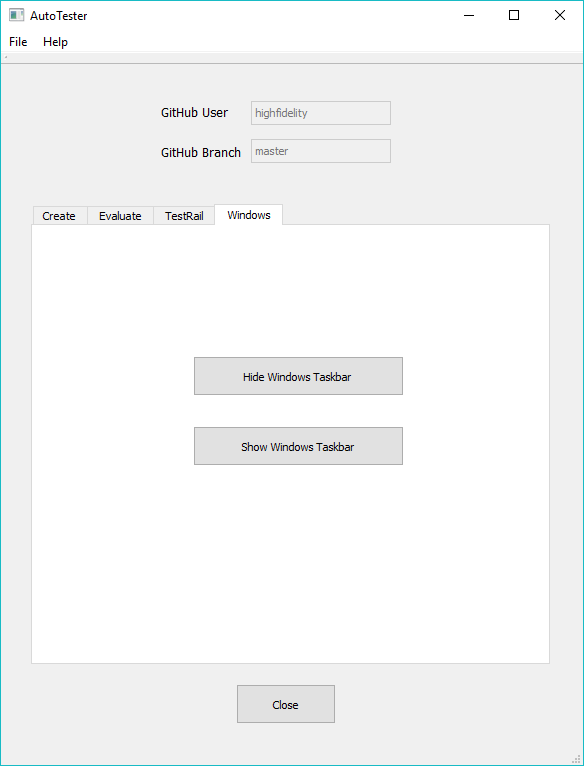
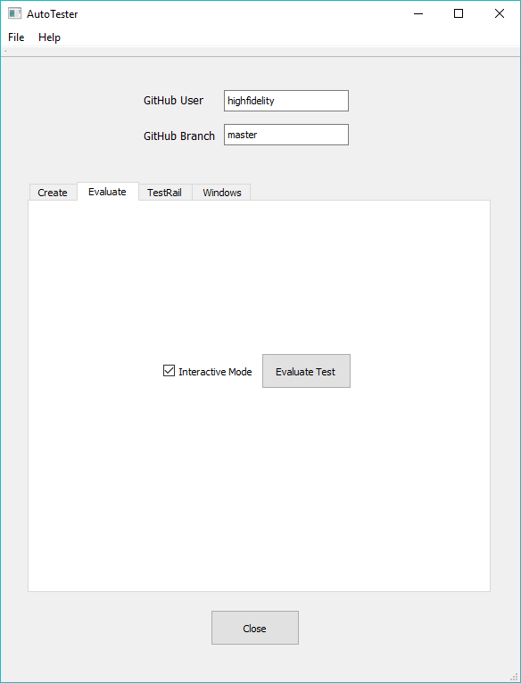

# Auto Tester

The auto-tester is a stand alone application that provides a mechanism for regression testing.  The general idea is simple:
* Each test folder has a script that produces a set of snapshots.
* The snapshots are compared to a 'canonical' set of images that have been produced beforehand.
* The result, if any test failed, is a zipped folder describing the failure.

Auto-tester has 5 functions, separated into 4 tabs:
1. Creating tests, MD files and recursive scripts
1. Windows task bar utility (Windows only)
1. Running tests
1. Evaluating the results of running tests
1. Web interface

## Installation
### Executable
1. Download the installer by browsing to [here](<https://hifi-content.s3.amazonaws.com/nissim/autoTester/AutoTester-Installer-v6.6.exe>).
2. Double click on the installer and install to a convenient location  

3. To run the auto-tester, double click **auto-tester.exe**.
### Python
The TestRail interface requires Python 3 to be installed. Auto-Tester has been tested with Python 3.7.0 but should work with newer versions.

Python 3 can be downloaded from:
1. Windows installer   <https://www.python.org/downloads/>
2. Linux (source)      <https://www.python.org/downloads/release/python-370/> (**Gzipped source tarball**)
3. Mac                 <https://www.python.org/downloads/release/python-370/> (**macOS 64-bit/32-bit installer** or **macOS 64-bit/32-bit installer**)
 
After installation - create an environment variable called PYTHON_PATH and set it to the folder containing the Python executable.
### AWS interface
#### Windows
1.  Download the AWS CLI from `https://aws.amazon.com/cli/`
1.  Install (installer is named `AWSCLI64PY3.msi`)
1.  Open a new command prompt and run `aws configure`
1.  Enter the AWS account number
1.  Enter the secret key
1.  Leave region name and ouput format as default [None]

1.  Install the latest release of Boto3 via pip:
>pip install boto3
# Create


The Create tab provides functions to create tests from snapshots, MD files, a test outline and recursive scripts.
## Create Tests
### Usage
This function is used to create/update Expected Images after a successful run of a test, or multiple tests.

The user will be asked for the snapshot folder and then the tests root folder.  All snapshots located in the snapshot folder will be used to create or update the expected images in the relevant tests.
### Details
As an example - if the snapshots folder contains an image named `tests.content.entity.zone.zoneOrientation.00003.png`, then this file will be copied to `tests/contente/enity/zone/zoneOrientation/ExpectedImage0003.png`.
## Create Tests Outline
### Usage
This function creates an MD file in the (user-selected) tests root folder.  The file provides links to both the tests and the MD files.
## Create MD file
### Usage
This function creates a file named `test.md` from a `test.js` script.  The user will be asked for the folder containing the test script:
### Details
The process to produce the MD file is a simplistic parse of the test script.
- The string in the `autoTester.perform(...)` function call will be the title of the file

- Instructions to run the script are then provided: 

**Run this script URL: [Manual]()   [Auto]()(from menu/Edit/Open and Run scripts from URL...).**

- The step description is the string in the addStep/addStepStepSnapshot commands

- Image links are provided where applicable to the local Expected Images files
## Create all MD files
### Usage
This function creates all MD files recursively from the user-selected root folder.  This can be any folder in the tests hierarchy (e.g. all engine\material tests).

The file provides a hierarchal list of all the tests 
## Create testAuto script
### Usage
This function creates a script named `testAuto.js` in a user-selected test folder.
### Details
The script created runs the `test.js` script in the folder in automatic mode.  The script is the same for all tests.
## Create all testAuto scripts
### Usage
This function creates all testAuto scripts recursively from the user-selected root folder.  This can be any folder in the tests hierarchy (e.g. all engine\material tests).

The file provides a hierarchical list of all the tests 
## Create Recursive Script
### Usage
After the user selects a folder within the tests hierarchy, a script is created, named `testRecursive.js`.  This script calls all `test.js` scripts in the sub-folders.
### Details
The various scripts are called in alphabetical order.

An example of a recursive script is as follows:  
```
// This is an automatically generated file, created by auto-tester on Jul 5 2018, 10:19

PATH_TO_THE_REPO_PATH_UTILS_FILE = "https://raw.githubusercontent.com/highfidelity/hifi_tests/master/tests/utils/branchUtils.js";
Script.include(PATH_TO_THE_REPO_PATH_UTILS_FILE);
var autoTester = createAutoTester(Script.resolvePath("."));

var testsRootPath = autoTester.getTestsRootPath();

if (typeof Test !== 'undefined') {
    Test.wait(10000);
};

autoTester.enableRecursive();
autoTester.enableAuto();

Script.include(testsRootPath + "content/overlay/layer/drawInFront/shape/test.js");
Script.include(testsRootPath + "content/overlay/layer/drawInFront/model/test.js");
Script.include(testsRootPath + "content/overlay/layer/drawHUDLayer/test.js");

autoTester.runRecursive();
```
## Create all Recursive Scripts
### Usage
In this case all recursive scripts, from the selected folder down, are created.

Running this function in the tests root folder will create (or update) all the recursive scripts.
# Windows


This tab is Windows-specific.  It provides buttons to hide and show the task bar.

The task bar should be hidden for all tests that use the primary camera.  This is required to ensure that the snapshots are the right size.
# Run

The run tab is used to run tests in automatic mode.  The tests require the location of a folder to store files in; this folder can safely be re-used for any number of runs (the "Working Folder"). 
The test script that is run is `https://github.com/highfidelity/hifi_tests/blob/master/tests/testRecursive.js`.  The user can use a different branch' or even repository, if required.  
Tests can be run server-less, or with the local host.  In the second case, the domain-server and assignment-clients are run before starting Interface.  
The default is to run the latest build.  The user can select a specific build or PR if desired.
Testing can be started immediately, or run on a schedule.  

A test run is performed in a number of steps:  
1.  If the latest run has been selected then the `dev-builds.xml` file is downloaded to identify the latest build.  
1.  The installer is then downloaded.  
1.  After downloading the High Fidelity application is installed.  This requires that UAC be disabled!
1.  Any instances of the server-console, assignment-client, domain-server or Interface are killed before running the tests.  
1.  Interface is run with the appropriate command line parameters.  
1.  The expected images are then downloaded from GitHub and compared to the actual images from the tests.

The working folder will ultimately contain the following:  
1.  A folder named `High Fidelity`.  This is where High Fidelity is installed.  
1.  A folder named `snapshots`.  This folder contains the zipped results folders (one for each run).  It also contains both the actual images and the expected images from the last run; note that these are deleted before running tests (All PNG files in the folder are deleted.  In addition - a text file named `tests_completed.txt` is created at the end of the test script - this signals that Interface did not crash during the test run.  
1.  The `dev-builds.xml` file, if it was downloaded.  
1.  The HighFidelity installer.  Note that this is always named `HighFidelity-Beta-latest-dev` so as not to store too many installers over time.  
1.  A log file describing the runs.  This file is appended to after each run.
# Evaluate


The Evaluate tab provides a single function - evaluating the results of a test run.

A checkbox (defaulting to checked) runs the evaluation in interactive mode.  In this mode - every failure is shown to the user, who can then decide whether to pass the test, fail it or abort the whole evaluation.

If any tests have failed, then a zipped folder will be created in the snapshots folder, with a description of each failed step in each test.
### Usage
Before starting the evaluation, make sure the GitHub user and branch are set correctly.  The user should not normally be changed, but the branch may need to be set to the appropriate RC.

After setting the check-box as required and pressing Evaluate - the user will be asked for the snapshots folder.
### Details
Evaluation proceeds in a number of steps:

1. A folder is created to store any failures

1. The expected images are download from GitHub.  They are named slightly differently from the snapshots (e.g. `tests.engine.render.effect.highlight.coverage.00000.png` and `tests.engine.render.effect.highlight.coverage.00000_EI.png`).

1. The images are then pair-wise compared, using the SSIM algorithm.  A fixed threshold is used to define a mismatch.

1.  In interactive mode - a window is opened showing the expected image, actual image, difference image and error:


1.  If not in interactive mode, or the user has defined the results as an error, an error is written into the error folder.  The error itself is a folder with the 3 images and a small text file containing details.

1.  At the end of the test, the folder is zipped and the original folder is deleted.  If there are no errors then the zipped folder will be empty.

# Web Interface

This tab has two functions:  updating the TestRail cases, runs and results, and creating web page reports that are stored on AWS.  

Before updating TestRail, make sure the GitHub user and branch are set correctly.  The user should not normally be changed, but the branch may need to be set to the appropriate RC.

Any access to TestRail will require the TestRail account (default is High Fidelity's account), a user-name and a password:


- The default test rail user is shown, and can be changed as needed.
- The user-name is usually the user's email.
- The Project ID defaults to 14 - Interface.
- The Suite ID defaults to 1147 - Rendering.
- The TestRail page provides 3 functions for writing to TestRail.
## Create Test Cases
### Usage
This function can either create an XML file that can then be imported into TestRail through TestRail itself, or automatically create the appropriate TestRail Sections.

The user will be first asked for the tests root folder and a folder to store temporary files (this is the output folder).

If XML has been selected, then the XML file will be created in the output folder.

If Python is selected, the user will then be prompted for TestRail data.  After pressing `Accept` - the Release combo will be populated (as it needs to be read from TestRail).

After selecting the appropriate Release, press OK.  The Python script will be created in the output folder, and the user will be prompted to run it.

A busy window will appear until the process is complete.
### Details
A number of Python scripts are created:
- `testrail.py` is the TestRail interface code.
- `stack.py` is a simple stack class
- `getReleases.py` reads the release names from TestRail
- `addTestCases` is the script that writes to TestRail.

In addition - a file containing all the releases will be created - `releases.txt`
## Create Run
A Run is created from previously created Test Cases.

The user will first be prompted for a temporary folder (for the Python scripts).

After entering TestRail data and pressing `Accept` - the Sections combo will be populated (as it needs to be read from TestRail).

After selecting the appropriate Section, press OK.  The Python script will be created in the output folder, and the user will be prompted to run it.

A busy window will appear until the process is complete.
### Details
A number of Python scripts are created:
- `testrail.py` is the TestRail interface code.
- `stack.py` is a simple stack class
- `getSections.py` reads the release names from TestRail
- `addRun` is the script that writes to TestRail.

In addition - a file containing all the releases will be created - `sections.txt`
## Update Run Results
This function updates a Run with the results of an automated test.

The user will first be prompted to enter the zipped results folder and a folder to store temporary files (this is the output folder).

After entering TestRail data and pressing `Accept` - the Run combo will be populated (as it needs to be read from TestRail).

After selecting the appropriate Run, press OK.  The Python script will be created in the output folder, and the user will be prompted to run it.

A busy window will appear until the process is complete.
### Details
A number of Python scripts are created:
- `testrail.py` is the TestRail interface code.
- `getRuns.py` reads the release names from TestRail
- `addRun` is the script that writes to TestRail.

In addition - a file containing all the releases will be created - `runs.txt`.
## Create Web Page
This function requests a zipped results folder and converts it to a web page.  The page is created in a user-selecetd working folder.  
If the `Update AWS` checkbox is checked then the page will also be copied to AWS, and the appropriate URL will be displayed in the window below the button.
